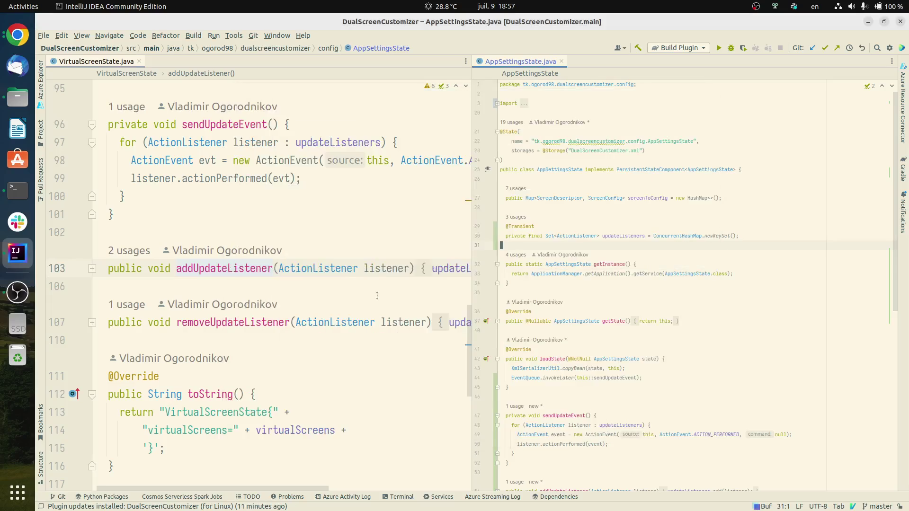
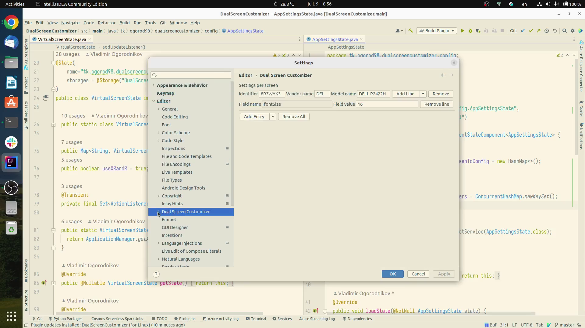
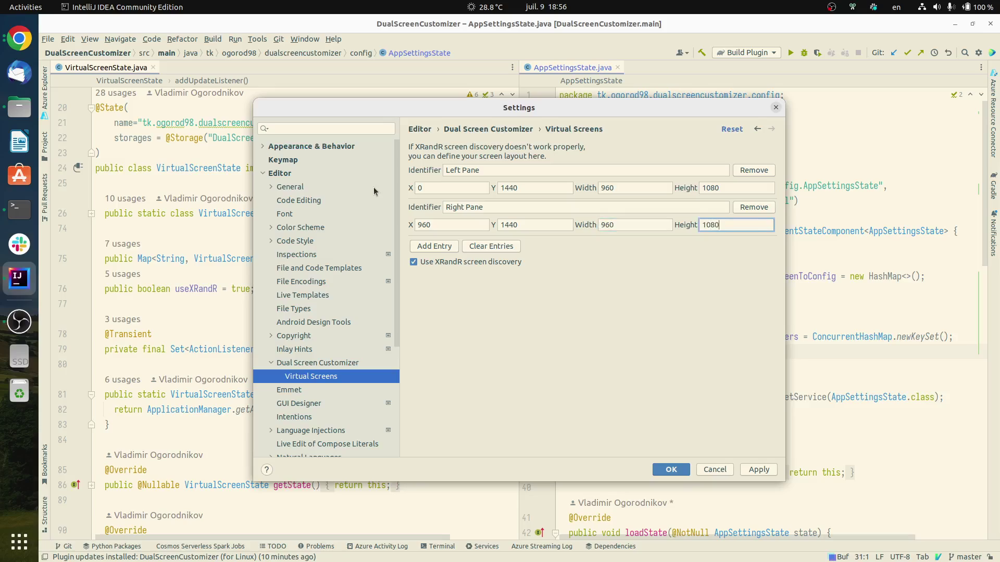

Dual Screen Customizer
===

Dual Screen Customizer is a plugin for JetBrains IDEs which allows to configure
editor appearance depending on which screen it is shown.

You can download it [here](https://plugins.jetbrains.com/plugin/19480-dualscreencustomizer-for-linux-).

Usecase
---

Imagine that you have two screens:
* 15" laptop screen with 1920x1080 resolution;
* 24" external screen also with 1920x1080 resolution.

Unfortunately, there is no easy way to set up per-monitor DPI in Ubuntu (well, it IS possible if you switch from X11 to Wayland, but it is still so buggy... [more info here](https://intellij-support.jetbrains.com/hc/en-us/articles/360007994999-HiDPI-configuration)). Thus, you can either select small font and crack your eyes while using the laptop screen or make font bigger and suffer from lack of free space on your second screen.

It would be very nice if you could say:
> Well, my IDE, if you're opened on the big screen, then set up small font size. Otherwise, select bigger font size!

And THIS is what this plugin actually does :)

Features
---

* Automatic screen config discovery using XRandR tool
* Virtual screens with custom geometry
* Font size and font family selection

Screenshots:
---

* Customization example 
* Settings screen 
* Virtual screens settings  